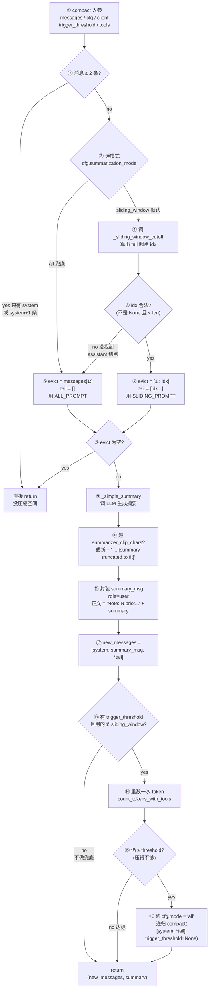
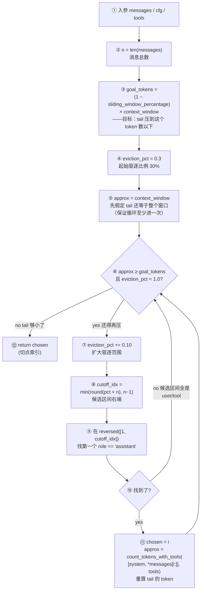
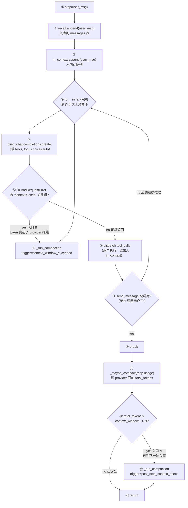

# Compaction 实现详解

memgpt-mini 的压缩逻辑全部集中在 [memgpt/compaction.py](../memgpt/compaction.py)，共约 260 行。本文档解释每个部分在做什么、为什么这样做，以及它如何跟 [memgpt/agent.py](../memgpt/agent.py) 的 step loop 协作。

## 1. 为什么需要压缩

LLM 的上下文窗口是硬上限（本项目默认 4000 token，DeepSeek 可开到 128k）。随着对话进行，`in_context` 列表不断增长，迟早会顶破窗口。压缩做的就是：**在顶破之前，把较早的消息换成一条"摘要"消息**，把窗口腾出来继续对话。

被"压缩掉"的消息并没有丢——它们还完整保留在 Postgres 的 `messages` 表里（recall memory），agent 想查随时能用 `conversation_search` 工具翻。

## 2. 两个触发入口

**入口 A：后置检查**（[agent.py:149 `_maybe_compact`](../memgpt/agent.py)）

```
每步 LLM 调用结束后 → 估算 prompt token 数 → 若 > context_window * 0.9 → 触发压缩
```

使用的 token 是 `resp.usage.total_tokens`（provider 真实回传的数），实在拿不到再退回本地 tiktoken 估算。

**入口 B：异常恢复**（[agent.py:89 `BadRequestError` 分支](../memgpt/agent.py)）

```
chat.completions.create 抛 BadRequestError，错误里含 "context"/"token" 关键词 → 触发压缩 → 重试同一步
```

这两个入口对应 Letta v3 里的 `post_step_context_check` 和 `ContextWindowExceededError` 两条路径（[letta_agent_v3.py:1261, 1515](/data/letta/letta/agents/letta_agent_v3.py)）。

## 3. 两种压缩模式

### 3.1 `sliding_window`（默认）

核心思想：**按比例挑一个"assistant 切点"，把系统消息到切点之间的全部内容摘要成一条 `role=user` 消息，切点之后的消息原样保留**。

算法（[compaction.py `_sliding_window_cutoff`](../memgpt/compaction.py)）：

```python
goal_tokens   = (1 - sliding_window_percentage) * context_window   # 默认 0.7 * window
eviction_pct  = sliding_window_percentage                          # 从 30% 开始
while approx_tokens >= goal_tokens and eviction_pct < 1.0:
    eviction_pct += 0.10
    cutoff_idx   = min(round(eviction_pct * n), n - 1)
    # 在 [1, cutoff_idx] 里 reversed 找 role=="assistant" 的索引
    chosen       = next(i for i in reversed(range(1, cutoff_idx+1))
                         if messages[i]["role"] == "assistant")
    approx_tokens = count_tokens_with_tools([system, *messages[chosen:]], tools)
return chosen
```

**关键设计：为什么切点必须是 assistant？**

因为一对完整的工具调用是这样的三元组：

```
[user] 帮我查一下备班
[assistant tool_calls=conversation_search]   ← 必须整体留在一起
[tool tool_call_id=call_xx]                   ← 必须整体留在一起
[assistant] 备班是陈晓...
```

如果切点落在 `tool` 上，`tail` 以孤立的 `role=tool` 开头，发给 OpenAI/DeepSeek 会直接 400：

> Messages with role 'tool' must be a response to a preceding message with 'tool_calls'

如果切点落在 `assistant tool_calls` 那一条上，那么 `tool` 就被挤进 `tail` 开头，同样出错。

**只有切点落在"干净的 assistant 消息"上，才能保证 tail 的第一条不是 tool**。Letta 的 `is_valid_cutoff` 规则完全一致（[summarizer_sliding_window.py:156](/data/letta/letta/services/summarizer/summarizer_sliding_window.py)）。

**为什么要 reversed 找？**

`reversed(range(1, cutoff_idx+1))` 表示"从候选区间的最右端开始往前找"。这样选到的 assistant 索引**最靠右**，也就是保留的 tail 尽可能长，evict 的 prefix 尽可能短。如果 tail 里的 token 还是超了，循环往下一轮把 `eviction_pct` 再加 10%，重新找更靠左的切点。

### 3.2 `all`（兜底模式）

直接把 system 之后的**全部消息**都送去摘要，tail 为空：

```python
evict  = messages[1:]
tail   = []
result = [system, summary_msg]      # 只剩两条
```

什么时候用到：
1. 显式设置 `summarization_mode="all"`
2. sliding_window 找不到合法 assistant 切点
3. sliding_window 压完之后 token 仍 ≥ threshold（post-compact fallback，见下）

## 4. Post-compact 保障

即便 sliding_window 压成功，也可能"压得不够"——比如要摘要的内容本身极长，产出的 summary 也超长，导致整体 token 还是超阈值。Letta 的做法是压完再数一次 token，若仍 ≥ threshold，**自动用 `all` 模式重跑一遍**。mini 原样实现（[compaction.py](../memgpt/compaction.py)）：

```python
if trigger_threshold and mode == "sliding_window":
    after = count_tokens_with_tools(new_messages, tools, cfg.model)
    if after >= trigger_threshold:
        retry_cfg = replace(cfg, summarization_mode="all")
        return await compact(
            [messages[0], *tail],   # 对已经缩小一轮的结果再来一次
            retry_cfg, client, trigger_threshold=None, tools=tools,
        )
```

`count_tokens_with_tools` 会把 `tools=TOOL_SCHEMAS` 也算进去（每轮 chat.completions 调用都会带这些 schema），避免 post-check 漏算。

## 5. 摘要 LLM 调用

[`_simple_summary`](../memgpt/compaction.py) 用和主对话**同一个** LLM 客户端（本项目是 DeepSeek），temperature=0.2：

```python
input_messages = [
    {"role": "system", "content": SLIDING_PROMPT 或 ALL_PROMPT},
    # 可选 ACK 消息（cfg.include_summary_ack=True 时）
    {"role": "assistant", "content": MESSAGE_SUMMARY_REQUEST_ACK},
    {"role": "user", "content": "<start_transcript>\n...\n<end_transcript>\nGenerate the summary."},
]
```

### 5.1 Transcript 渲染

被驱逐的消息通过 `_render` 转成纯文本，工具调用名通过 `tool_call_id` 关联回 `assistant.tool_calls`：

```
[user] 我是张伟...
[assistant] [tool_calls: core_memory_append]
[tool_result core_memory_append] 姓名：张伟...
[assistant] 好的，已记下你的信息
```

这样 LLM 在摘要阶段也能看到"我之前调了哪些工具，结果是什么"。

### 5.2 两份 Prompt

- **`SLIDING_PROMPT`**：滑窗模式用，强调"被驱逐的内容出现在保留内容之前作为背景"，要求 ≤300 词，分 5 节：高层目标、发生了什么、重要细节（逐字保留 ID/数字/路径）、错误与修复、**查找提示（lookup hints）**——查找提示这部分是关键，告诉后续 agent 如果需要某类信息，该用什么关键词去 `conversation_search` / `archival_memory_search`。

- **`ALL_PROMPT`**：全量兜底用，放宽到 ≤500 词。

两份 prompt 都来自 Letta 的 [prompts/summarizer_prompt.py](/data/letta/letta/prompts/summarizer_prompt.py)，只是简化了格式。

### 5.3 ACK 消息（可选）

某些模型（尤其是 OpenAI 的 GPT-4 系列）直接收到"请总结这段对话"会产生幻觉——误以为要"继续原对话"。Letta 用一条伪造的 assistant 回复做确认 priming：

```
system:    "请总结被驱逐的内容..."
assistant: "Understood, I will respond with a summary ..."   ← fake ACK
user:      "<start_transcript>...<end_transcript>"
```

mini 把它做成 `cfg.include_summary_ack` 开关，默认关（DeepSeek 测试下来不需要，关掉能省 token）。

## 6. 最终消息布局

压缩结束，新的 `in_context` 是：

```
[system]  ← 每步重新渲染，不入 in_context，只是拼接
[role=user] Note: N prior message(s) have been hidden from view due to
             conversation memory constraints. The following is a summary
             of the previous messages:
             <summary 正文>
[assistant] ... tail[0]，一定是 assistant 消息
[user]      ... tail[1]
[assistant] ... tail[2]
...
```

为什么 summary 用 `role=user` 而不是 `role=system` 或新自定义 `role=summary`？因为 OpenAI/DeepSeek 的 chat.completions 只接受 `system / user / assistant / tool` 四种角色。Letta 在自家 ORM 里有个新加的 `role=summary`，但**发给 provider 前 `to_openai_dict()` 会把它转成 `role=user`**（[compact.py:462](/data/letta/letta/services/summarizer/compact.py)）。mini 没自己的 ORM 中间层，所以直接存 `role=user`，语义等价。

消息体里的 `Note: N prior messages...` 前缀不是 Letta 原创，而是来自 MemGPT 原始代码（`package_summarize_message_no_counts`）——它给 LLM 一个清晰信号："我看到的 [0] 消息不是真正的对话开头"。

## 7. 跟 agent step loop 的集成

```
MemGPTAgent.step(user_msg):
    recall.append(user_msg)
    in_context.append(user_msg)

    for _ in range(max_tool_steps):
        resp = client.chat.completions.create(...)         # [A]
        ...tool dispatch...
        if send_message called: break

    _maybe_compact(resp.usage)                             # [B]

  [A] 抛 BadRequestError 若 context 超限
      → _run_compaction(trigger="context_window_exceeded")
      → continue 循环重试

  [B] 若 resp.usage.total_tokens > context_window * 0.9
      → _run_compaction(trigger="post_step_context_check")
```

`_run_compaction` 接管后，内部会：
1. 构造 `[system, *in_context]`
2. 调 `compact()`
3. 把返回的新列表（去掉 system 那条，因为 system 每步重新渲染）覆盖回 `self.in_context`
4. 把 summary 文本保存到 `self.last_compaction_summary`（给 test_story 的追踪用）

## 8. 配置清单

所有 compaction 相关的 knob 都集中在 [Config](../memgpt/config.py)：

| 字段 | 默认 | 说明 |
|---|---|---|
| `summarization_trigger` | `0.9` | 触发阈值比例（占 context_window） |
| `summarization_mode` | `"sliding_window"` | 或 `"all"` |
| `sliding_window_percentage` | `0.3` | 初始驱逐比例，loop 每轮 +10% |
| `summarizer_clip_chars` | `50000` | 摘要正文超长时截断，防止 summary 本身顶破窗口 |
| `include_summary_ack` | `False` | 是否插入 fake ACK 消息 |
| `message_buffer_min` | `3` | 保留兼容字段，当前 sliding_window 不再使用（tail 大小由 token 反推） |

环境变量：`MEMGPT_SUMMARIZATION_MODE` / `MEMGPT_SLIDING_WINDOW_PCT`。

## 9. 关键 Letta 源码映射

| mini 位置 | Letta 对应 |
|---|---|
| `_sliding_window_cutoff` | [summarizer_sliding_window.py:130-203 `summarize_via_sliding_window`](/data/letta/letta/services/summarizer/summarizer_sliding_window.py) |
| `_is_valid_cutoff` | [summarizer_sliding_window.py:156-161](/data/letta/letta/services/summarizer/summarizer_sliding_window.py) |
| `ALL_PROMPT` 分支 | [summarizer_all.py `summarize_all`](/data/letta/letta/services/summarizer/summarizer_all.py) |
| Post-compact fallback | [compact.py:360-412](/data/letta/letta/services/summarizer/compact.py) |
| `[system, summary, *tail]` | [compact.py:462-465](/data/letta/letta/services/summarizer/compact.py) |
| SLIDING_PROMPT 原文 | [prompts/summarizer_prompt.py:28-45](/data/letta/letta/prompts/summarizer_prompt.py) |
| `_simple_summary` 结构 | [summarizer.py:488-551](/data/letta/letta/services/summarizer/summarizer.py) |
| 两个触发入口 | [letta_agent_v3.py:1261, 1515](/data/letta/letta/agents/letta_agent_v3.py) |

## 10. 测试

- [`tests/test_modules.py::test_compaction`](../tests/test_modules.py) — 端到端：构造含 tool_calls/tool_result 对的消息，调真实 LLM 做摘要，断言 tool pair 完整性
- [`tests/test_modules.py::test_sliding_window_cutoff`](../tests/test_modules.py) — 纯逻辑单测：验证切点永远落在 assistant
- [`tests/test_modules.py::test_post_compact_fallback`](../tests/test_modules.py) — monkeypatch 验证 sliding → all 兜底切换
- [`tests/test_story.py`](../tests/test_story.py) — 完整 11 轮剧本，自然触发多次压缩，验证压缩后 `conversation_search` 仍能召回闲聊

## 11. 逻辑图

四张图覆盖压缩模块的全部关键路径。每张图下都有一段"读图指南"——按数字编号走一遍节点，遇到关键决策点展开讲原因。

---

### 11.1 `compact()` 主流程

`compact()` 是整个压缩模块的唯一对外入口。它只做三件事：**挑切点 → 摘要 → 兜底再查一次**。



**读图指南**：

- **①→②**：入口先做安全检查——只有 system 或 system+1 条消息，根本没东西可压，直接原样返回。
- **③**：两种模式二选一。sliding_window 是默认（保留 tail），all 是兜底（全摘掉）。
- **④→⑥→⑦**：sliding_window 的核心是 `_sliding_window_cutoff()`（§11.2 展开讲）。它返回一个索引 `idx`——tail 从这条开始。`evict` 是 system 之后到 idx 之前要被摘要的消息。
- **⑥→⑤**：如果 `_sliding_window_cutoff()` 连一个合法的 assistant 切点都找不到（比如整段对话全是 user/tool，没有一条 clean assistant），自动降级到 `all` 模式——至少不会报错退出。
- **⑨**：`_simple_summary` 就是调一次 LLM，让它读 `evict` 里的所有消息，输出一段文本摘要。prompt 在 §5.2 讲过。
- **⑩**：摘要本身也可能很长。如果 LLM 返回了 10 万字的摘要，那就还是顶破窗口，所以硬截断 50000 字符（`summarizer_clip_chars`）。
- **⑪**：摘要封装成一条 `role=user` 消息，前缀加 `Note: N prior message(s) have been hidden...`——告诉后续 LLM "你看到的不是对话开头"。为什么是 `user`？§6 讲过，provider 只认 4 种 role，user 是最通用的选择。
- **⑫**：新的消息列表布局 = `[原 system, 摘要消息, 保留的 tail...]`。
- **⑬→⑯**：**post-compact fallback**。sliding_window 压一次可能不够——比如 evict 里本来就 3 万字，摘出来 2 千字，但 tail 本身还是 4 千字，整体仍超窗口。这时候切换到 `all` 模式（连 tail 也摘掉）递归调一次。`trigger_threshold=None` 防止第二次再触发兜底，避免无限递归。

**一句话总结**：挑一个安全切点 → 前半段摘要 → 如果还不够小，就激进地把 tail 也摘了。

---

### 11.2 `_sliding_window_cutoff()` 迭代选切点

这是整个模块最精巧的部分。核心难题：**要切哪里**？切太靠前压不动，切太靠后破坏 tool_calls/tool 对。



**读图指南**：

- **③ `goal_tokens`**：压缩目标。默认 `sliding_window_percentage=0.3`，意思是"希望 tail 占窗口的 70%"。比如 4000 token 窗口，goal = 2800。循环一直跑到 tail ≤ 2800 为止。
- **④ 起始 30%**：第一轮先试"驱逐前 30% 的消息"——这是温和起点。如果这已经够了就不用再压。
- **⑤ `approx = context_window`**：这是个**初始化技巧**。循环条件 `approx >= goal_tokens` 必须成立才能进循环，所以先赋一个必然大于 goal 的值（整个窗口大小）。第一轮结束时会重新算出真实 tail 的 token。
- **⑥ 退出条件**：两种退出——tail 够小了（成功），或 `eviction_pct >= 1.0`（驱逐到整段都没了，循环自然终止）。后者对应"怎么切都压不下"的病态场景，交给 §11.1 ⑬ 兜底。
- **⑦ `+= 0.10`**：**为什么是 10%**？这是 Letta 的经验值——每轮递增太小（比如 1%）循环次数爆炸；太大（比如 50%）过度压缩浪费保留空间。10% 是平衡点。
- **⑧ `cutoff_idx`**：把"驱逐比例"翻译成"索引"。比如 n=20, pct=0.4，cutoff_idx=8，意味着"候选在 [1, 8] 之间找"。`min(..., n-1)` 防止溢出。
- **⑨ reversed + assistant**：这是**最关键的设计**。
  - `reversed(range(1, cutoff_idx+1))` 意思是从候选区间的**右边**往左扫。
  - 为什么从右扫？因为切点越靠右，tail 越长，保留的近期对话越多——记忆损失最小。
  - 为什么必须 `role=='assistant'`？看 §3.1 的三元组规则：`user → assistant(tool_calls) → tool → assistant`。如果切在 `tool` 那一条上，tail 开头就是孤立的 `role=tool`，provider 直接 400。只有 clean assistant 切点能保证 tool 对留在 evict 侧，不会被劈开。
- **⑩→⑥**：如果候选区间里一个 assistant 都没有（罕见：一整段都是 user 在自言自语），直接跳下一轮，扩大范围再找。
- **⑪→⑥**：找到切点后，重新算 `[system, *messages[i:]]` 的 token 数——这是 tail 的真实长度。如果还超 goal，继续往下一轮。

**举例**（n=20, context_window=4000, goal=2800）：

```
round 1: pct=0.4, cutoff_idx=8, 候选 [1..8]
         reversed 扫 → 发现 messages[7] 是 assistant → chosen=7
         算 [system, *messages[7:]] = 3200 token（仍 > 2800）
round 2: pct=0.5, cutoff_idx=10, 候选 [1..10]
         reversed → messages[10] 是 tool，[9] 是 tool，[8] 是 assistant(tool_calls)
         [7] 是 assistant ✓ → chosen=7（还是 7，但 cutoff_idx 扩大了没换到更右的）
         ……不对，第一轮就 chosen=7 了，approx 还在 3200
round 3: pct=0.6, cutoff_idx=12, 候选 [1..12]
         reversed → messages[12] 是 assistant ✓ → chosen=12
         算 [system, *messages[12:]] = 2100 token ≤ 2800 ✓ 退出
return 12
```

最终 `evict = messages[1:12]`，`tail = messages[12:]`。

---

### 11.3 Agent step loop 与两个压缩入口

压缩不是"定时跑"，而是**事件驱动**。两个事件：(A) LLM 回来发现 token 数已经接近上限，(B) provider 报 400 说超了。



**读图指南**：

- **②/③ 双写**：用户消息同时进 `recall`（DB 持久化）和 `in_context`（内存队列）。recall 永不删，in_context 会被压缩。这是论文的"dual write"模式。
- **④ 6 步上限**：`max_tool_steps=6`。防止 LLM 陷入工具调用死循环。
- **⑤→⑥ 入口 B（异常路径）**：正常情况下不应走这里。但如果 `in_context` 攒太多、系统 prompt 很长、或者单条消息本身巨大，provider 会直接回 400。mini 抓住这个异常、**立刻压缩**、然后 `continue` 让 `for` 循环重试同一步。这是 Letta 的 `ContextWindowExceededError` 路径。
- **⑦ `continue` 回到 ④**：注意是 `continue`，不是重新进 `step()`。这样 user_msg 不会被二次 append。
- **⑧ tool dispatch**：正常返回后，有 tool_calls 就执行。每个工具结果作为 `role=tool` 消息追加到 in_context。
- **⑨ send_message 特殊**：这是唯一一个"我要回用户了"的信号 tool。一旦调了，跳出循环去做 post-check。
- **⑨→④ 回循环**：如果没调 send_message，说明 LLM 还在用工具链收集信息，下一轮继续推理。
- **⑪→⑫ 入口 A（正常路径）**：这才是**大多数时候触发**压缩的地方。每步 LLM 都会在 `resp.usage.total_tokens` 里告诉你"我这次读了多少 token"。如果已经过 90%，下一步大概率会超——所以在这里**主动**压缩，避免走入口 B 的异常路径。
- **为什么 0.9 而不是 1.0？**：留 10% 缓冲给下一轮的 user 输入和 LLM 输出。如果卡到 100% 才触发，下一轮 LLM 返回几百 token 直接就超了。

**两个入口的关系**：入口 A 是主动预防（正常），入口 B 是被动兜底（异常）。设计良好时入口 B 应该几乎不触发；但 token 计算有估算误差，留着这条路是保险。

---

### 11.4 压缩前后 `in_context` 布局

抽象说了半天，来一个具体例子。假设 `context_window=4000`，跑了几轮对话后攒到了 3700 token，触发 ⑫ 压缩。

```mermaid
flowchart LR
    subgraph Before["Before：3700 token，超 0.9 阈值"]
        direction TB
        B0["[0] system (每轮动态渲染，<br/>不在 in_context list 里)"]
        B1["[1] user: 你好我叫张伟"]
        B2["[2] assistant<br/>tool_calls=core_memory_append"]
        B3["[3] tool result: 姓名：张伟..."]
        B4["[4] assistant: 已记下你的信息"]
        B5["[5] user: 我们系统 QPS 峰值 5000"]
        B6["[6] assistant<br/>tool_calls=archival_memory_insert"]
        B7["[7] tool result: Inserted passage..."]
        B8["[8] assistant: 已归档这个事实"]
        B9["[9] user: 你还记得我叫什么吗?"]
    end
    subgraph After["After：sliding_window, chosen=8"]
        direction TB
        A0["[0] system (依旧每轮渲染)"]
        A1["[1] user (摘要注入):<br/>'Note: 7 prior messages hidden...'<br/>+ '我是张伟，告诉过助手...<br/>系统 QPS 峰值 5000（已归档）...'<br/>+ 'Lookup hints: 张伟、QPS'"]
        A2["[2] assistant: 已归档这个事实<br/>（原 B8，tail[0]）"]
        A3["[3] user: 你还记得我叫什么吗?<br/>（原 B9，tail[1]）"]
    end
    Before -->|"_sliding_window_cutoff 返回 8<br/>evict = B1..B7（7 条）<br/>tail = B8..B9（2 条）"| After
```



**读图指南**：

- **切点选在 `[8]`**：因为 `[8]` 是 clean assistant（没带 tool_calls，只是纯回复）。切在这里保证 `[6]→[7]` 的 tool_calls/tool 对完整留在 evict 侧，不会被切开。
- **evict 是 `[1..7]`**（不含 `[8]`）：7 条消息被送进 LLM 做摘要。
- **摘要输出**：LLM 读完 evict 后产出一段中文，被包成 `role=user` 消息注入为新的 `[1]`。前缀 `Note: 7 prior messages hidden...` 是给后续 LLM 的明确信号——"你看到的第一条不是真正的对话开头"。
- **tail 变成新的 `[2]`、`[3]`**：原来的 `[8]`、`[9]` 原样保留，只是索引前移。
- **核心不变量**：
  - `After[0]` 必是 system（根本没进压缩逻辑，每步渲染）
  - `After[1]` 必是摘要（`role=user`）
  - `After[2]`（tail 第一条）**必是 assistant**——这是 `_is_valid_cutoff` 的强制保证。只要这条成立，整个 tail 的 tool_calls/tool 对就一定成对。
- **recall 里还有**：`[1..7]` 的原始消息完整留在 Postgres `messages` 表（按 `agent_id` 过滤）。后续用户问"一开始我说什么？"时，LLM 可以 `conversation_search('张伟')` 把这些原件捞回来——摘要丢了细节，recall 没丢。

**这就是 MemGPT 三层记忆的协作**：in_context（压缩摘要） + recall（原始消息持久化） + archival（向量事实库）。压缩只动第一层，其他两层不受影响，所以"被压掉的信息"永远可以通过工具找回来。
